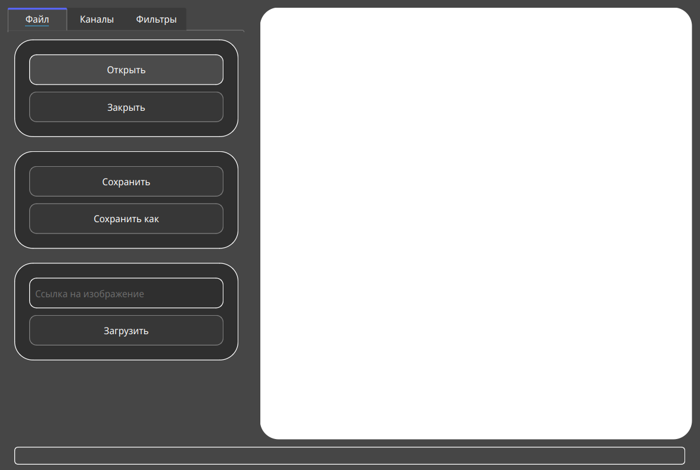
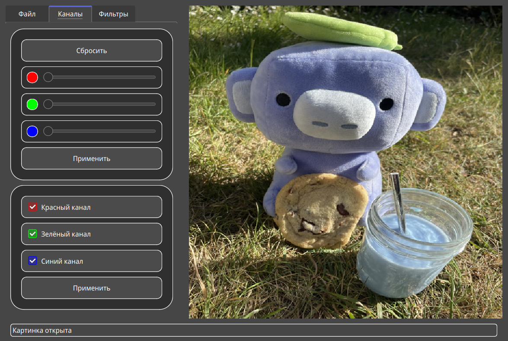
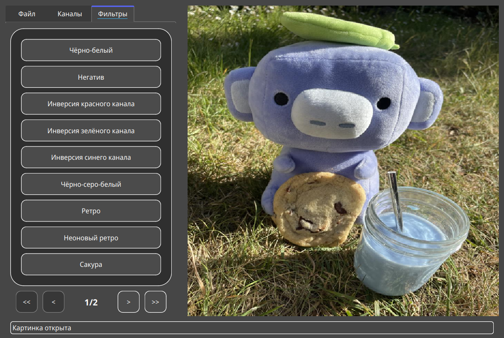
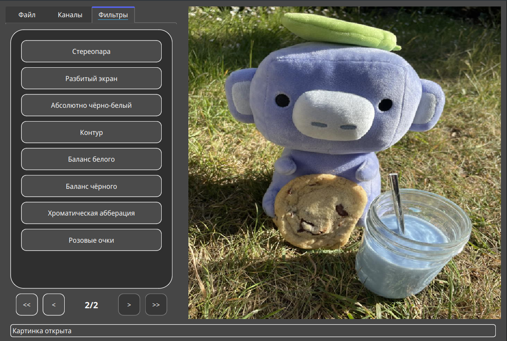

---

# Краткая характеристика
* Наименование программы: **Abrotbuar** - умный (сейчас - нет) фоторедактор (aka фотошоп).
* Назначение программы: программа для **обработки** фото.
* Конечные пользователи: ***"дизайнеры"***.

# Техническое задание
Часто бывает необходимо отредактировать фотографию или картинку. Но на лицензию фотошопа нет денег. Поэтому данная
программа создана специально для замещения таких программ.

Краткий список возможностей:
- Большое количество фильтров
- Возможность создавать пресеты
- Работа со слоями
- Свёртка (возможно)
- Кластеризация (возможно)
- Сегментация (возможно)

## Начало

Для начала необходимо открыть или скачать изображение

## Каналы

Можно увеличить значение канала или отключить определённые каналы

## Фильтры

Можно применить различные фильтры

## Пресеты

*не**много*** не готово

